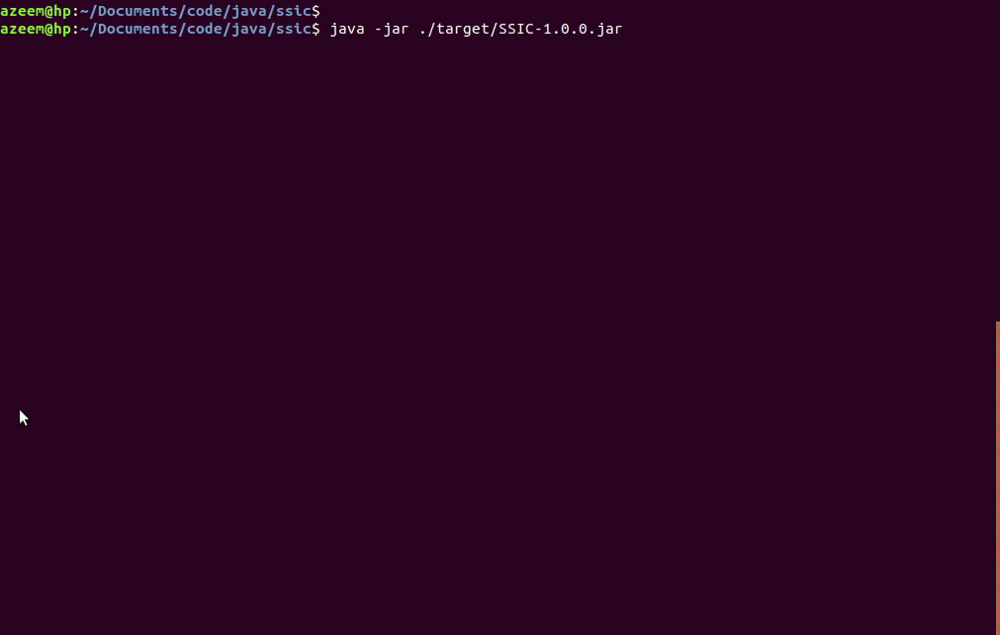

#  SSIC (Sequence Similarity and Identity Calculator)

SSIC is a global alignment tool to calculate the similarity and identity of DNA and protein sequences.

## Depedencies

* Java
* BioJava (3.1.0)
  * biojava3-core
  * biojava3-alignment
* Maven

## Demo

## Contact

Email: azeem.sajid@gmail.com  
LinkedIn: https://www.linkedin.com/in/az33msajid/
